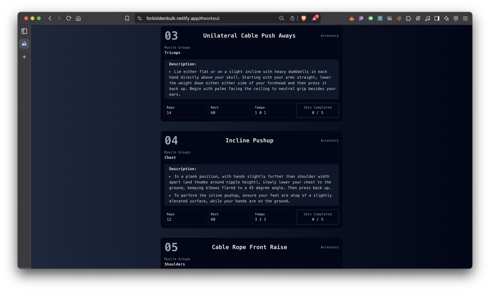

# forbiddenBulk 💪

## Overview

**forbiddenBulk** is a cutting-edge web application designed to [briefly describe the main functionality or purpose of your project]. Built with modern web technologies, it offers users [highlight key features or benefits].

## Table of Contents

- [Features](#features)
- [Demo](#demo)
- [Installation](#installation)
- [Technologies Used](#technologies-used)
- [How to Use](#how-to-use)
- [Acknowledgements](#acknowledgements)

## Features

- [Feature 1]: [Brief description]
- [Feature 2]: [Brief description]
- [Feature 3]: [Brief description]
- [Feature 4]: [Brief description]
- [Feature 5]: [Brief description]

## Demo

🔗 **Live Demo:** [forbiddenBulk](https://forbiddenbulk.netlify.app/)




## Installation

1. Clone the repository:

   ```bash
   git clone https://github.com/thepushkarB/forbiddenBulk.git
   cd forbiddenBulk
   ```

2. Install dependencies (ensure you have Node.js installed):

   ```bash
   npm install
   ```

## Run the Application

```bash
npm run dev
```


## Technologies Used

- **ReactJS** – JavaScript library for building user interfaces
- **Vite** – Next-generation frontend tooling
- **Tailwind CSS** – Utility-first CSS framework

## How to Use

1. [Step 1]: [Instruction]
2. [Step 2]: [Instruction]
3. [Step 3]: [Instruction]
4. [Step 4]: [Instruction]

## Acknowledgements

- [James for training algo & exercise data](https://github.com/jamezmca)
